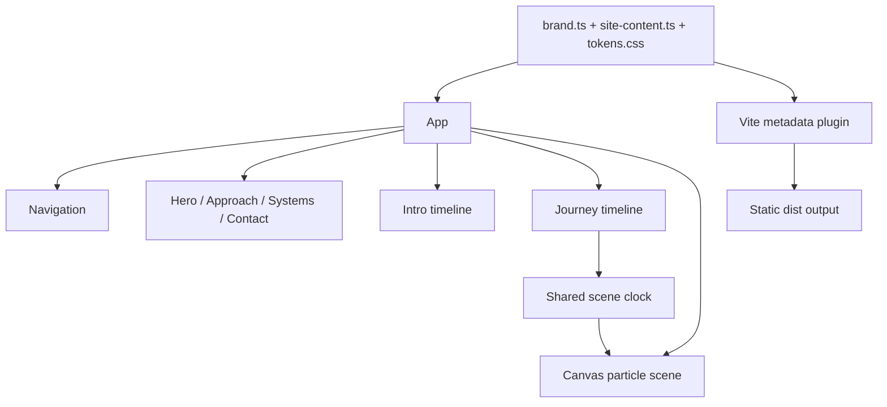

# Implementation architecture

## Runtime model

The app is a static single-page React application. There is no backend, CMS, analytics service, runtime font CDN, or third-party data API. Vite compiles the site to `dist/`; a static host can serve it.



`App` owns the shared experience state:

- `reduced`: media-query preference.
- `touch`: coarse-pointer timing mode.
- `fine`: custom-cursor eligibility.
- `ready`: intro has completed.
- `paused`: ambient motion preference.
- `journey`: calculated viewport-height landmarks.
- `clock`: mutable `{ h, paused, ready }` shared with the canvas without forcing React renders every animation frame.

## Source ownership

```text
src/
  app/          experience assembly and state ownership
  animation/    GSAP registration, timings, scroll mapping, Canvas scene
  components/   reusable interaction and rendering primitives
  config/       brand identity and base-safe public asset resolution
  content/      typed business copy and repeatable story data
  hooks/        media-query and measured-text utilities
  sections/     semantic page regions
  styles/       fonts, tokens, global rules, layout, interactions
public/
  brand/        logo, motif, favicon, social preview
  media/        original temporary concept illustrations
```

Important component responsibilities:

- `Navigation`: desktop links, accessible full-screen menu, focus trap, Escape handling, scroll locking, route-like scene navigation.
- `BrandMotif`: loads the replaceable motif, samples alpha, owns Canvas lifecycle and GSAP ticker cleanup.
- `MediaFrame`: base/alternate image rendering and optional crossfade with cleanup.
- `ContextCursor`: fine-pointer-only visual cursor with link/explore states.
- `Magnetic`: hover translation on an inner wrapper so it does not conflict with layout/scroll transforms.
- Sections contain semantic structure and render only content supplied by configuration.

## Content and configuration flow

`brand.ts` is build-time and runtime input. Vite imports it to generate title, description, favicon, Open Graph values, canonical URL, robots.txt, and optional sitemap. React imports the same object for visible identity and contact details.

`site-content.ts` supplies navigation labels, intro words, hero descriptor, company positioning, capabilities, system stories, philosophy, and contact copy. Story count feeds `createJourney`, so adding or removing stories changes scroll length automatically.

`assetUrl()` prepends `import.meta.env.BASE_URL` to public paths. Use root-looking configured paths such as `/media/example.webp`; do not concatenate deployment paths in components.

## CSS architecture

- `tokens.css`: only global theme values and layer constants.
- `fonts.css`: legal self-hosted font declarations.
- `global.css`: reset, semantic defaults, fixed-scene primitives.
- `layout.css`: composition and responsive transformations.
- `interactions.css`: intro, menu, cursor, focus/hover, reduced-motion overrides.

The DOM uses separate wrappers where multiple transforms may coexist. Preserve this when adding magnetic, scroll, or hover effects; two systems writing the same `transform` property will overwrite each other.

## Build-time behavior

`vite.config.ts` contains an independently authored metadata plugin:

- Replaces HTML placeholders with escaped brand configuration.
- Adds canonical and `og:url` only when `brand.seo.siteUrl` is non-empty.
- Always emits `robots.txt`.
- Emits `sitemap.xml` only for a confirmed public URL.
- Supports `BASE_PATH` for subdirectory hosting.

## Invariants

- TypeScript is strict and unused values are errors.
- GSAP contexts, tickers, media contexts, observers, and event listeners must clean up on unmount.
- Generated `dist/` and QA JSON are not source.
- Business copy must not migrate into JSX.
- Accessibility state (`inert`, `aria-hidden`, focus restoration) must remain synchronized with visual state.
